# Homepage

## Setup homepage

Go to Admin -> Appearance -> Theme options (tab Page) to select a homepage.

## Customize homepage

Go to Admin -> Pages -> Select Homepage.

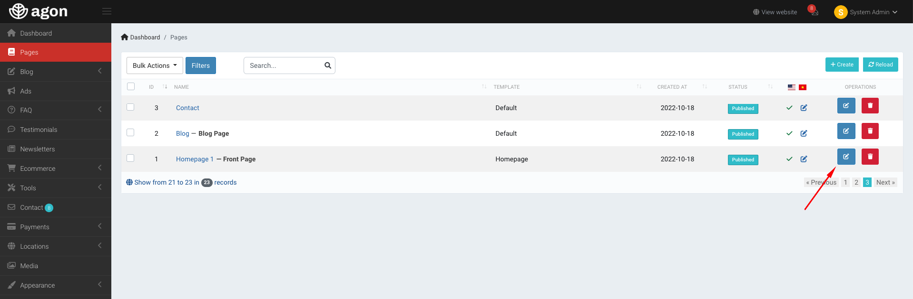

Hero Banner

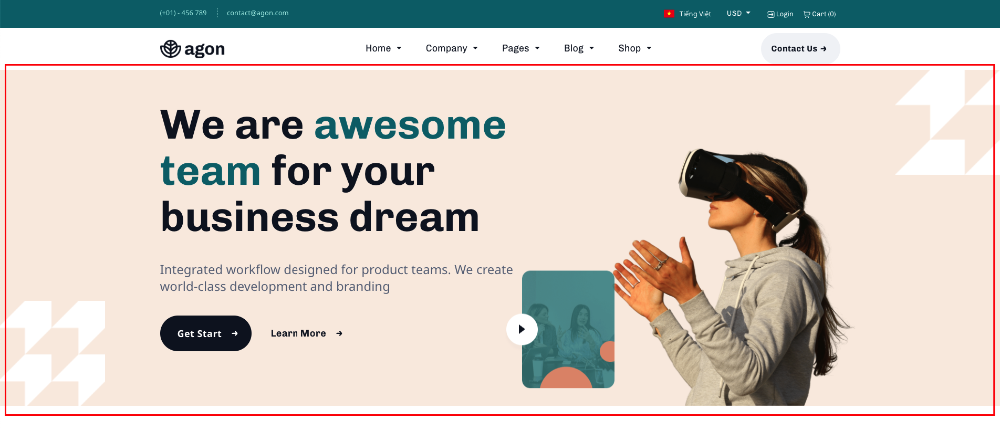

It's shortcode `home-hero` in the page content.

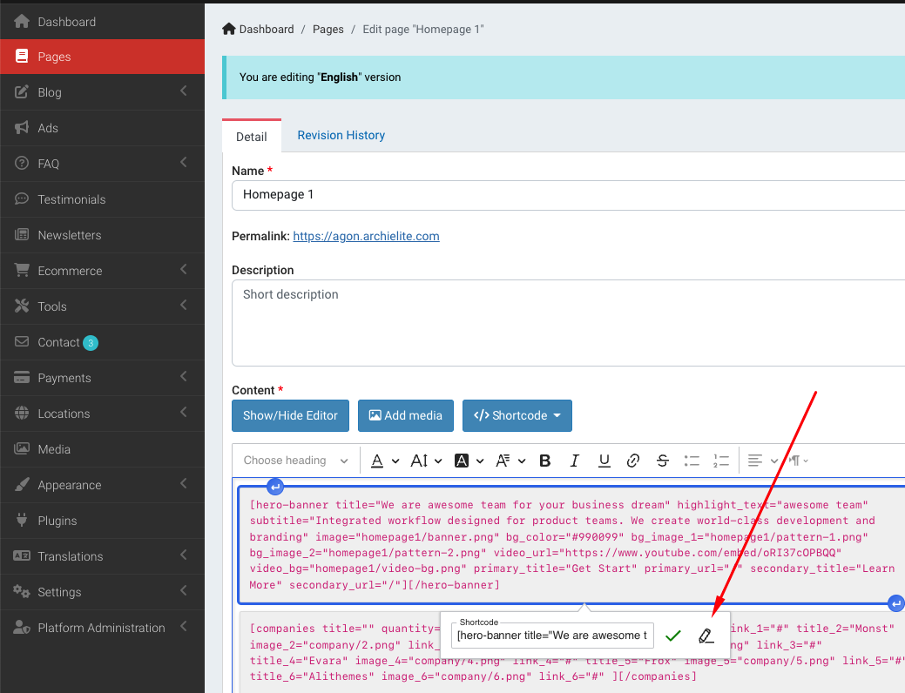

You can set the title, subtitle, image and background image.

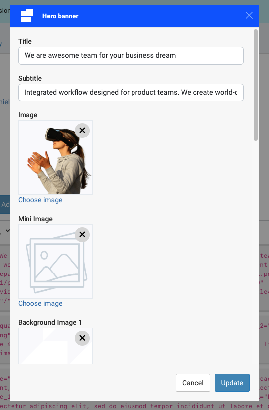

Companies

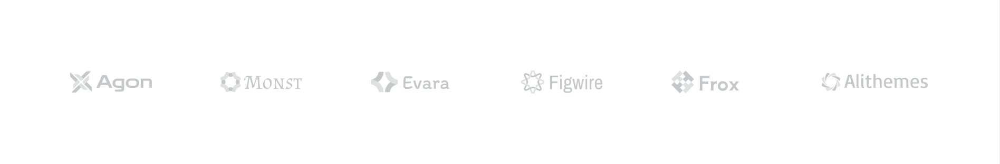

You also can custom company items in the `companies` shortcode.

Plan section

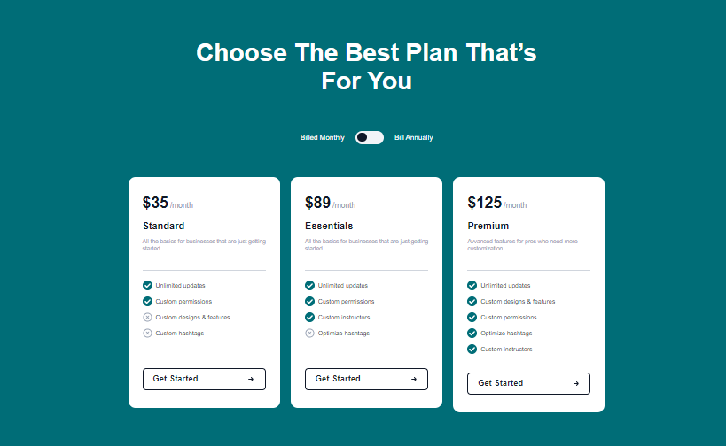

This is `quotation` shortcode.

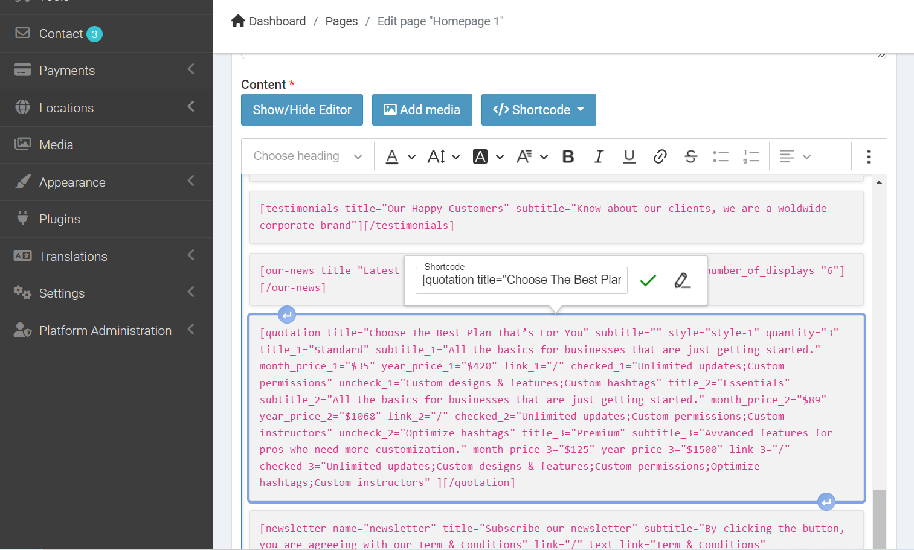

Latest news

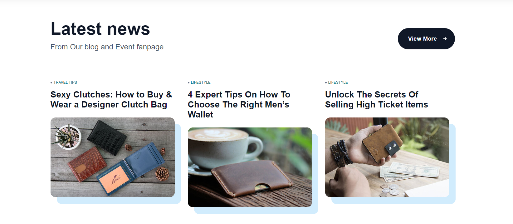

The shortcode of the Latest News block is `our-news`.

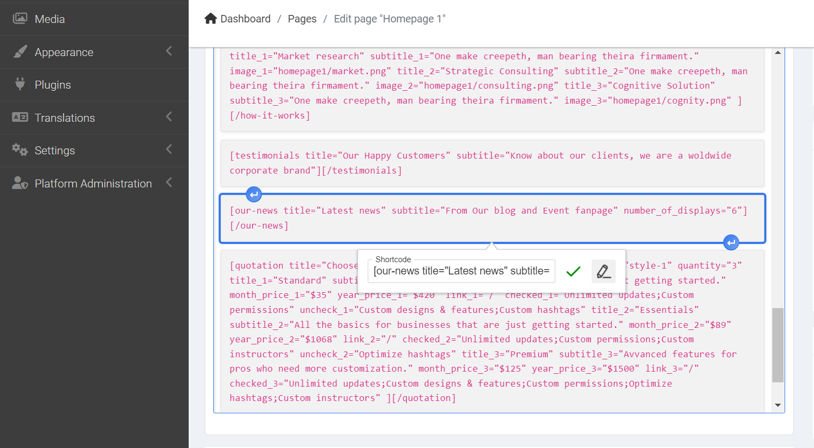

Newsletter

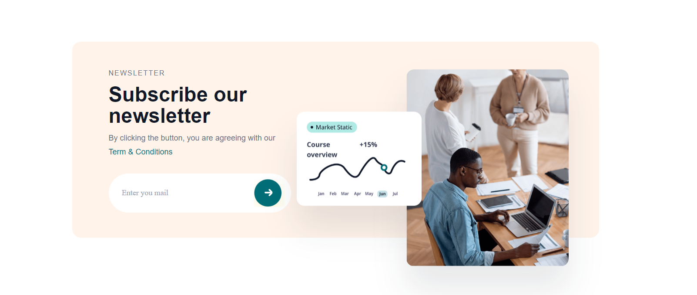

The shortcode of the Newsletter subscribe form is `newsletter`.

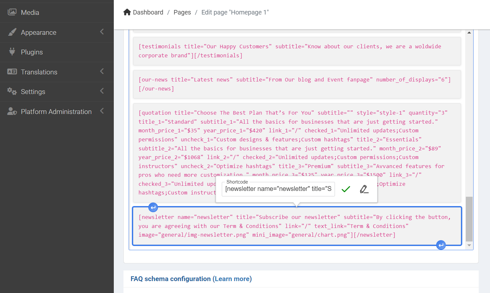

### Other shortcodes

- `we-are-trusted`

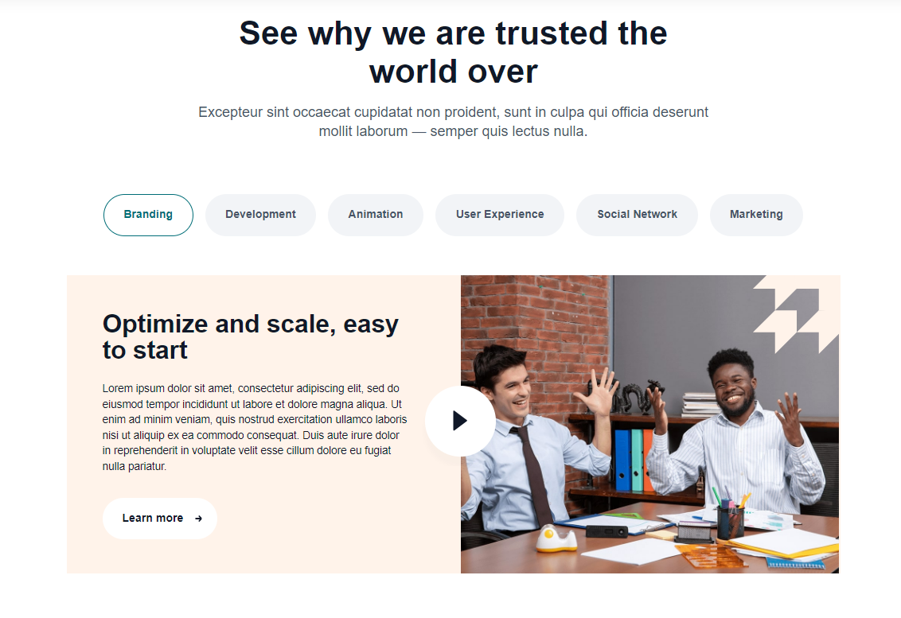

- `we-facilitate`

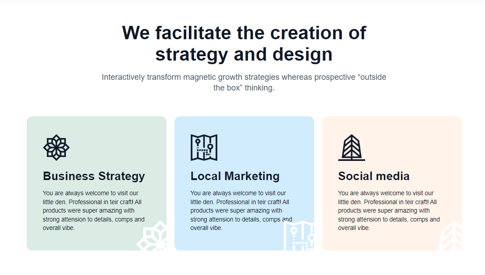

- `we-do-you-get`

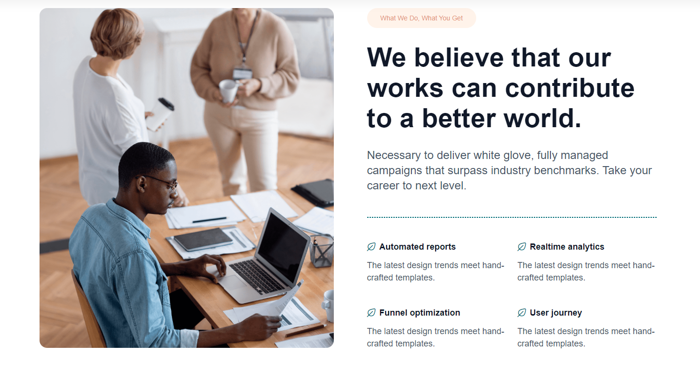

- `testimonials`

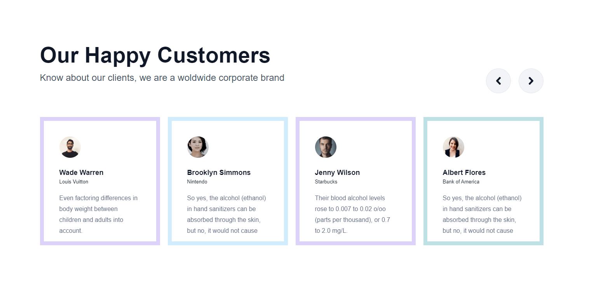

- `how-it-works`

There are have a lot of shortcodes in the theme. You can check them in the **Shortcode** dropdown menu in the editor.

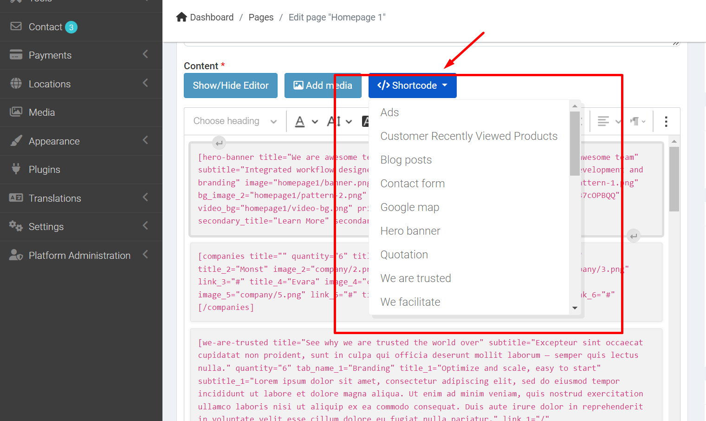
