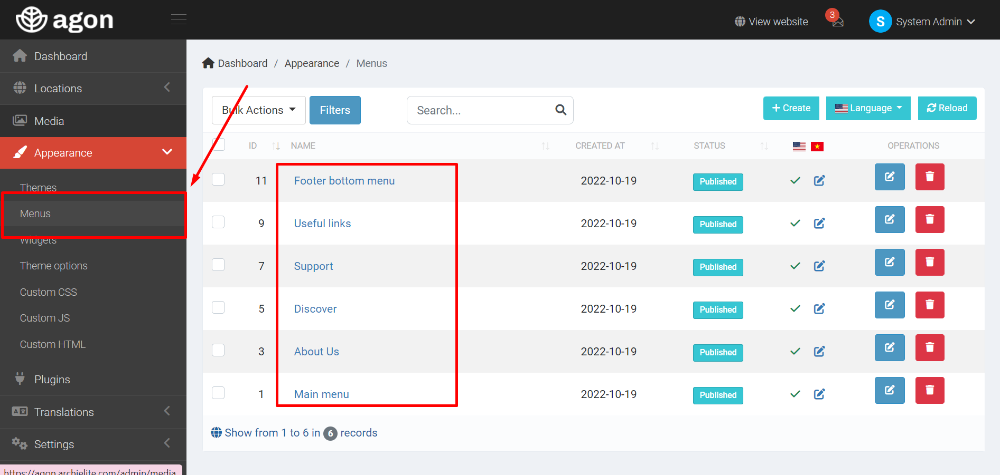
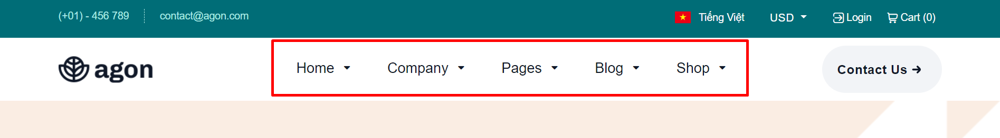
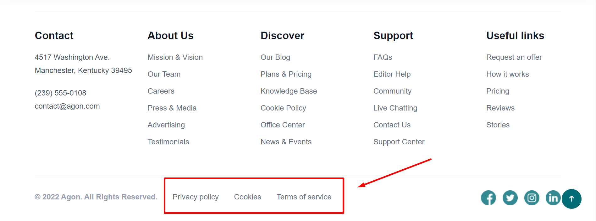
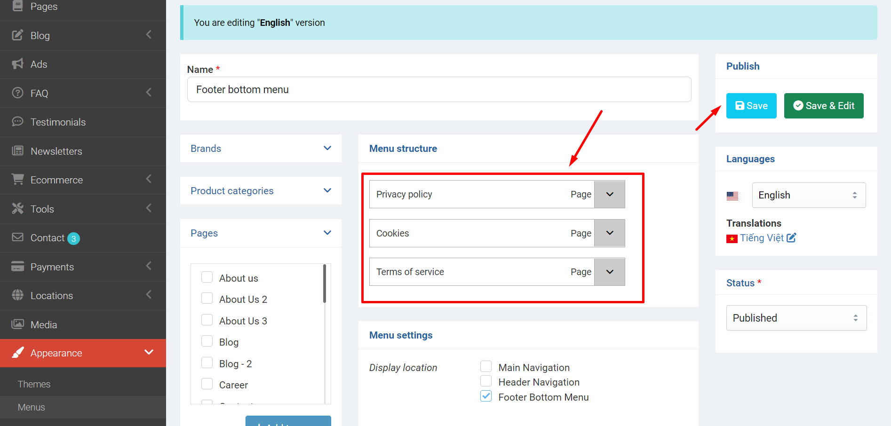

# Setup Menu

You can manage your menu from `Admin` -> `Appearance` -> `Menus`.

## Main menu

Main menu is the menu bar on the header. You can manage menu items from `Admin` -> `Appearance` -> `Menus` -> click **Edit** button on the `Main menu` row.

## Footer menu

Footer menu located on the bottom of the page. You can manage these items from `Admin` -> `Appearance` -> `Menus` -> click **Edit** button on the `Footer bottom menu` row.

