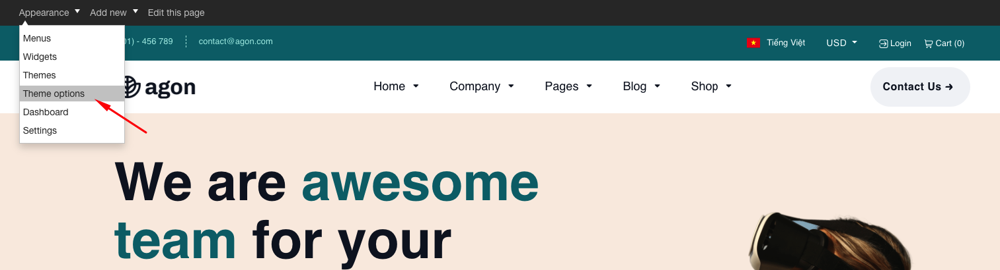
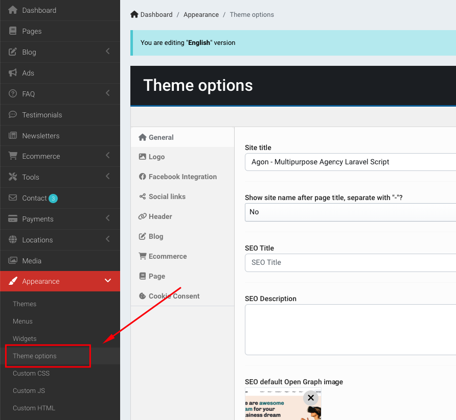
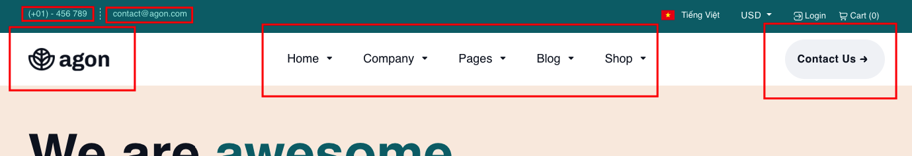
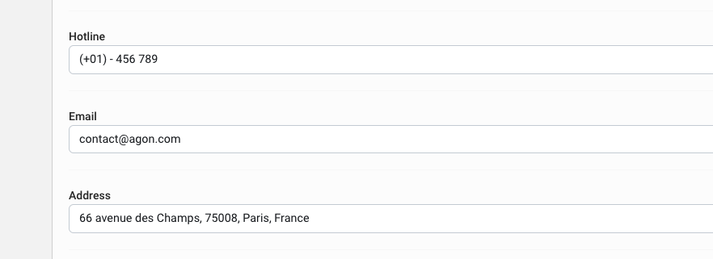
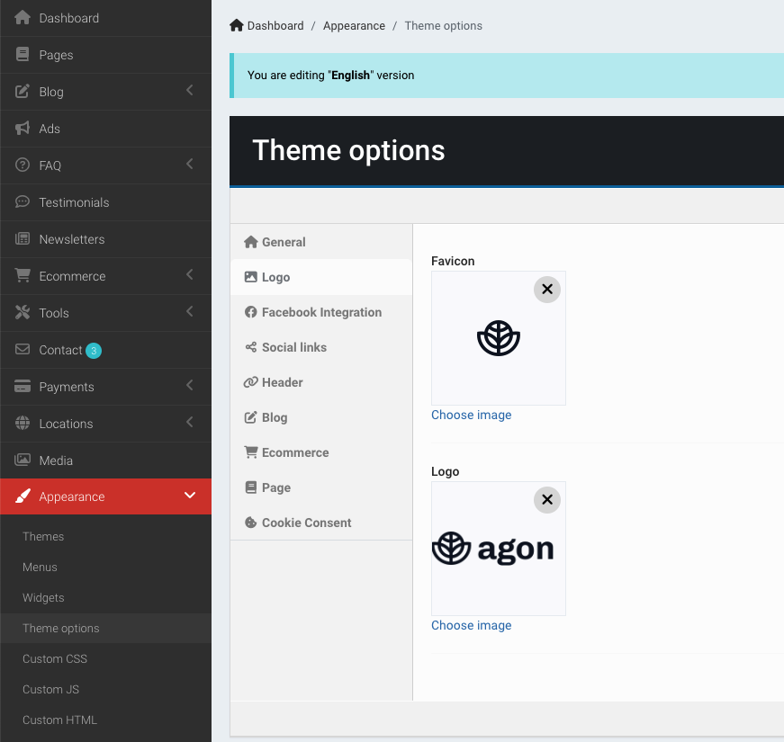
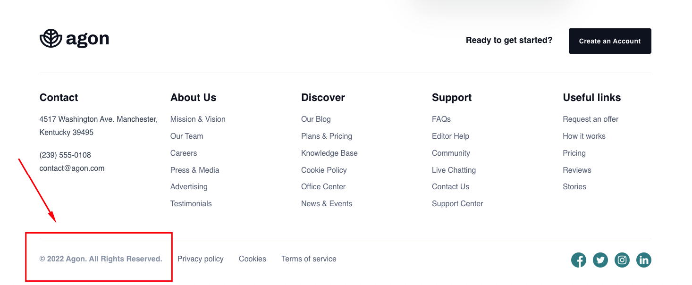
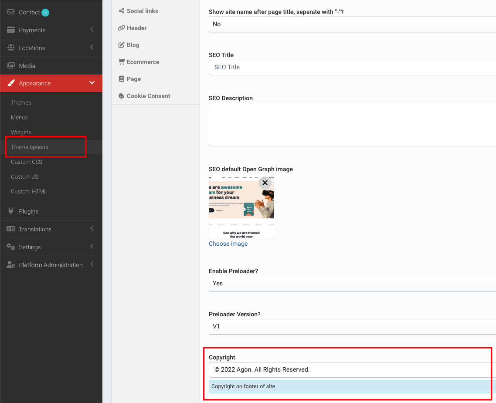

# Theme Options

## Setup theme options

On Admin Bar -> Appearance -> Theme options.

Or go to Admin -> Appearance -> Theme options.

## Header

Customize header

Edit **Hotline** and **Email**. Go to Admin -> Appearance -> Theme options -> General tab.

Edit **Logo** and **Favicon**. Go to Admin -> Appearance -> Theme options -> Logo tab.

Edit **Contact Us** button. Go to Admin -> Appearance -> Theme options -> Header tab.

## Footer

Edit copyright text

Go to Admin -> Appearance -> Theme options -> General tab

Edit social links, go to Admin -> Appearance -> Theme options -> Social links tab

## Others

Edit **Cookie consent**"

Go to Admin -> Appearance -> Theme options -> Cookie consent tab

