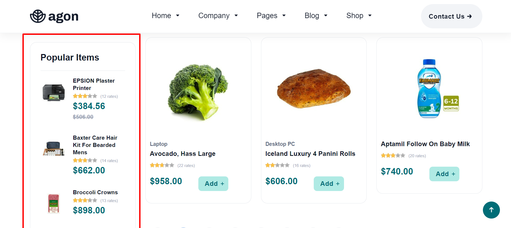
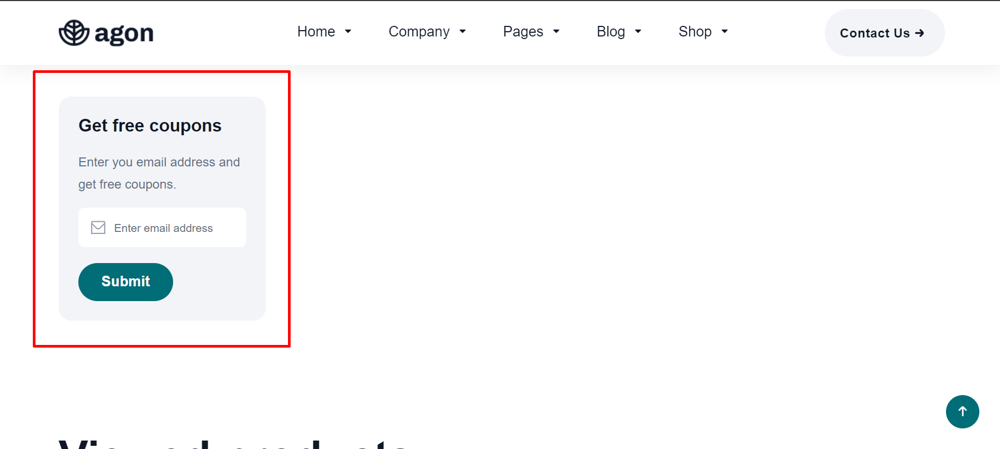
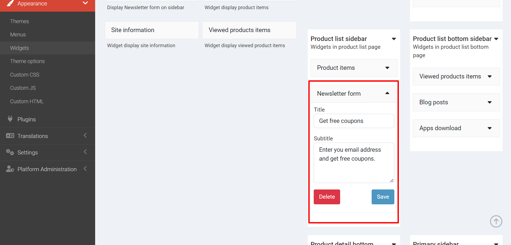

# Usage Widgets

You can customize widgets in `Admin` -> `Appearance` -> `Widgets`.

## Product List

In the left sidebar, you can see a **Popular Items** and **Newsletter** form.

First, this is a list of the most popular items in the shop.

You can modify it in `Admin` -> `Appearance` -> `Widgets` -> **Product list sidebar**

Second, below the Popular items is the Newsletter form.

You can also modify it in **Product list sidebar** like Popular items.

